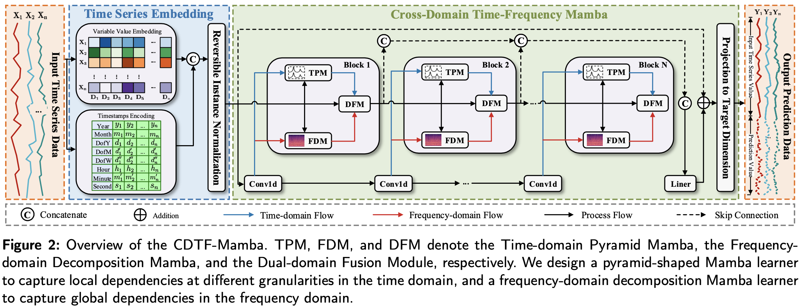

# Cross-Domain Time-Frequency Mamba (CDTF-Mamba)

> Official implementation for the paper:  
> "Cross-Domain Time-Frequency Mamba: A More Effective Model for Long-Term Time Series Forecasting"

CDTF-Mamba is a novel architecture for **Long-Term Time Series Forecasting (LTSF)** that models time series synergistically in both the **time** and **frequency** domains.  
It captures **local fluctuations** and **global trends** while retaining the linear complexity and efficiency of the Mamba architecture.

## Abstract

Long-term time series forecasting is critical in domains such as smart energy systems and industrial IoT. Existing methods face intertwined challenges because single-domain modeling often fails to capture both **local fluctuations** and **global trends**, leading to incomplete temporal representations.

**CDTF-Mamba** addresses these issues by modeling time series in both **time** and **frequency** domains:

- **Time-domain Pyramid Mamba (TPM)**: Disentangles multi-scale patterns to capture local dependencies at different temporal granularities.  
- **Frequency-domain Decomposition Mamba (FDM)**: Stabilizes state evolution, mitigates non-stationarity, and captures periodic/global dependencies.  

Experiments on twelve benchmark datasets demonstrate CDTF-Mamba outperforms state-of-the-art methods in **accuracy, efficiency, and scalability**.
## Architecture Overview

## Installation
pip install -r requierment.txt  

## Usage
Dataset Preparation

## Datasets used:

ETTh, ETTm, Weather, Traffic, PEMS, Solar-Energy, Exchange, Electricity


Place dataset (e.g., PEMS08.npz) under root_path:

./data/PEMS


Specify paths in argparse:

--root_path
--data_path
```python
## Train Model
python main.py \
    --is_training 1 \
    --model_id "CDTF_Mamba_test" \
    --model "CDTF-Mamba" \
    --data "PEMS" \
    --root_path "./data/PEMS" \
    --data_path "PEMS08.npz" \
    --seq_len 96 \
    --pred_len 12 \
    --enc_in 170 \
    --num_layers 2 \
    --n1 512 \
    --d_state 256 \
    --dconv 2 \
    --e_fact 1 \
    --k 3 \
    --ch_ind 1 \
    --revin 1 \
    --batch_size 16 \
    --learning_rate 0.001 \
    --train_epochs 50 \
    --use_gpu True \
    --gpu 0

## Test Model
python main.py \
    --is_training 0 \
    --model_id "CDTF_Mamba_test" \
    --model "CDTF-Mamba" \
    --data "PEMS" \
    --root_path "./data/PEMS" \
    --data_path "PEMS08.npz" \
    --seq_len 96 \
    --pred_len 12 \
    --enc_in 170 \
    --num_layers 2 \
    --n1 512 \
    --d_state 256 \
    --k 3 \
    --ch_ind 1 \
    --revin 1 \
    --use_gpu True \
    --gpu 0

